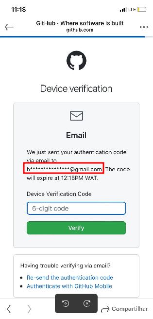

# Ocultar email

Já todo mundo deve ter visto aquela mensagem para confirmar a sua conta ou
a remoção de algum repositório do github, posto na tela a forma como o email é
escondido deixando apenas a primeira letra visível e ocultando o resto das informações.

Como na imagem à baixo.



Bem, pensei em construir o mesmo algorítmo que conseguentemente foi um desafio proposto pelo Herlander Bento,
daí consegui listar duas formas para a resolução do mesmo desafio.

Tendo em conta a performance e qualidade de código.

As soluções foram as seguintes.

1. A primeira solução seria fazer um split e criar um novo array porém repetindo o `*` em
   função do número de caracteres que o testo possue ignorando a primeira posição e depois concatenar
   com o resto das informações. Claro que essa solução resolveria o problema.

```javascript
/**
 *  first solution for hide email
 *
 * @params email: string
 */
function hideEmail(email) {
  const [name, domain] = email.split('@');
  const at = new Array(name.length).join('*');

  return name[0] + at + '@' + domain;
}

console.log(hideEmail('antoniocamposgabrielpedro@gmail.com'));

output:
a************************@gmail.com

```

Como quis deixar um pouco mais símples o código, a segunda opção foi.

2. Usar expressões regulares para percorrer todo o texto (transformando em array), ignorar o primeiro
   character e deliminar a seleção dos textos até antes do `@` em seguinda substiruir tudo por `*`

```javascript
/**
 *  First solution for hide email
 *
 * @params email: string
 */
function hideEmail(email) {
  const hideEmail = email.replace(/(?<=.{1}).(?=.*@)/gi, '*');

  return hideEmail;
}

console.log(hideEmail('antoniocamposgabrielpedro@gmail.com'));

output:
a************************@gmail.com

```

Acredito ter sido simples e proveitoso, deu para pensar em pouco.

Espero ter ajudado alguém com isso!.
